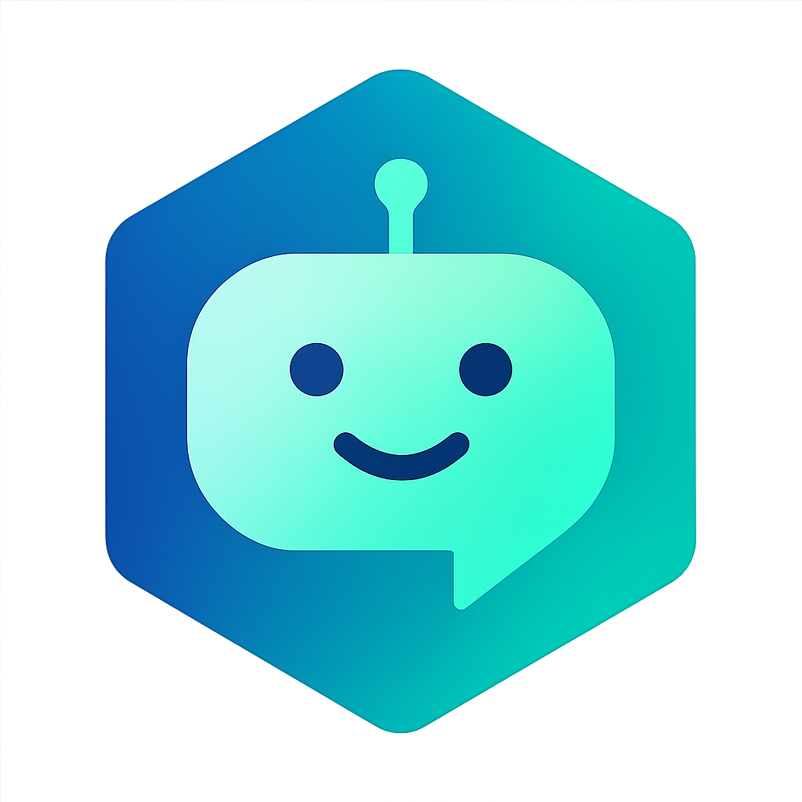

# Support bot service



> [!WARNING]
> This service is under development.

> [!NOTE]
> A Go-based bot support service designed to handle customer inquiries, order management, and provide intelligent responses using event-driven architecture and MCP (Model Context Protocol) services.

### Documentation

- [Environment Setup](./docs/ENVIRONMENT.md) - Configuration and environment variables

### ADR

- [ADR-0001](./docs/ADR/decisions/0001-init.md) - Init project

### Architecture

We use the C4 model to describe architecture.

#### System context diagram

```plantuml
!include https://raw.githubusercontent.com/shortlink-org/shortlink/main/docs/c4/containers/preset/common.puml
!include https://raw.githubusercontent.com/shortlink-org/shortlink/main/docs/c4/containers/preset/c1.puml

LAYOUT_WITH_LEGEND()

title System Context diagram for Bot Support Service

Person(customer, "Customer", "A customer using the support bot")
Person(supportAgent, "Support Agent", "A human support agent")

System(botSupportSystem, "Bot Support System", "Provides intelligent customer support and order management")

System_Ext(mcpServices, "MCP Services", "Model Context Protocol services for AI/ML capabilities")
System_Ext(orderSystem, "Order System", "External order management system")

Rel(customer, botSupportSystem, "Uses", "HTTP/WebSocket")
Rel(supportAgent, botSupportSystem, "Manages", "Admin Interface")
Rel(botSupportSystem, mcpServices, "Calls", "API")
Rel(botSupportSystem, orderSystem, "Queries", "API")
```

#### Use case diagram

The use case diagram shows which functionality of the developed software system is
available to each group of users.

```plantuml
!include https://raw.githubusercontent.com/shortlink-org/shortlink/main/docs/c4/containers/preset/common.puml
!include https://raw.githubusercontent.com/shortlink-org/shortlink/main/docs/c4/containers/preset/usecase.puml

LAYOUT_WITH_LEGEND()

title Use Case diagram for Bot Support Service

Person(customer, "Customer", "A customer using the support bot")
Person(supportAgent, "Support Agent", "A human support agent")

UseCase(researchOrder, "Research Order State", "Query and retrieve order status information")
UseCase(trackOrder, "Track Order Progress", "Monitor order processing and delivery status")
UseCase(handleInquiry, "Handle Customer Inquiry", "Process and respond to customer questions")
UseCase(generateReport, "Generate Support Report", "Create reports on support interactions and metrics")
UseCase(projectStatus, "Project Status", "Get project status and task information via GitHub MCP")

Rel(customer, researchOrder, "Uses")
Rel(customer, trackOrder, "Uses")
Rel(customer, handleInquiry, "Uses")
Rel(supportAgent, researchOrder, "Uses")
Rel(supportAgent, handleInquiry, "Uses")
Rel(supportAgent, generateReport, "Uses")
Rel(supportAgent, projectStatus, "Uses")
Rel(customer, projectStatus, "Uses")
```

**Use cases**:

- [UC-1](./internal/usecases/shop/order/state) - Research state of order
- [UC-2](./internal/usecases/project/status) - Status of project (GitHub MCP integration)
