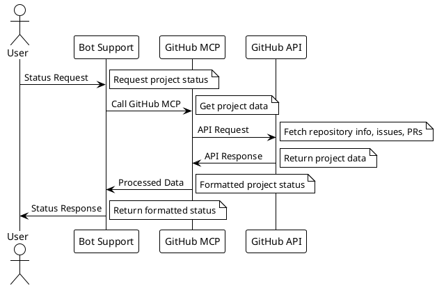

## UC-2: Status of project

### Description
Track and retrieve project status information using GitHub MCP (Model Context Protocol) to get real-time data about project tasks, issues, and overall progress.

### Flow

### GitHub MCP Integration
- **Repository Information**: Get repository details, branches, and recent activity
- **Issues Tracking**: Retrieve open/closed issues and their status
- **Pull Requests**: Monitor PR status and review progress
- **Project Boards**: Access project board information and task status
- **Milestones**: Track milestone progress and deadlines

### Use Cases
- **Project Overview**: Get high-level project status and progress
- **Task Status**: Check specific task or issue status
- **Team Progress**: Monitor team activity and contributions
- **Release Tracking**: Track milestone and release progress

### Implementation Notes
- Uses GitHub MCP for secure API access
- Caches frequently requested data for performance
- Provides both summary and detailed status views
- Supports filtering by time range and status type

### References
- [Beyond the Chatbot: Event-Driven Agents in Action](https://www.docker.com/blog/beyond-the-chatbot-event-driven-agents-in-action/) - Docker blog post on building event-driven applications with agentic AI using GitHub MCP and Docker MCP Gateway 