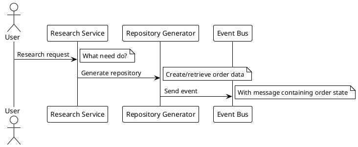

## UC-1: Research state of order

```plantuml
@startuml
!theme plain
skinparam backgroundColor transparent

actor User
participant "Research Service" as RS
participant "Repository Generator" as RG
participant "Event Bus" as EB

User -> RS: Research request
note right: What need do?

RS -> RG: Generate repository
note right: Create/retrieve order data

RG -> EB: Send event
note right: With message containing order state

@enduml
```

